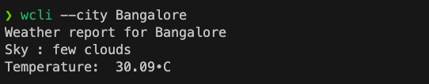

<center> 

# Weather Pilot CLI


[](https://choosealicense.com/licenses/mit/)
[](https://www.python.org/downloads/release/python-370/)

</center>


## Table of Contents 

- [About](#about)
- [Getting Started](#getting_started)
- [Usage](#usage)


## Demo




## About <a name = "about"></a>

The Weather Pilot CLI is a command line interface that allows users to get weather information for a given location. The CLI is built using the [OpenWeather API](https://openweathermap.org/api). The CLI is built using the [Click](https://click.palletsprojects.com/en/7.x/) library.

## Getting Started <a name = "getting_started"></a>

These instructions will get you a copy of the project up and running on your local machine for development and testing purposes.

clone the repository

```bash
git clone https://github.com/mahimairaja/weather-pilot-cli.git
```

cd into the directory

```bash
cd weather-pilot-cli
```


### Prerequisites

Before installing you need register for an API key from [OpenWeather](https://openweathermap.org/api). Once you have your API key you can install the CLI.


Add your API key to the .env file

```bash
echo "secret=your_api_key" >> weather_cli/.env
```

### Installing

> A step by step series of examples that tell you how to get a development env running.

Create a virtual environment using [venv](https://docs.python.org/3/library/venv.html) or [virtualenv](https://virtualenv.pypa.io/en/latest/).

```bash
python3 -m venv venv
```

Activate the virtual environment.

```bash
source venv/bin/activate
```

Install the requirements.

```bash
pip install -r requirements.txt
```

Install the CLI.

```bash
pip install -e .
```


## Usage <a name = "usage"></a>

get the current weather for a given location

```bash
wcli --city CITY_NAME
```

> NOTE : The project is built based on Linux environment. 

## License <a name = "license"></a>

This project is licensed under the MIT License - see the [LICENSE.md](LICENSE.md) file for details

All rights reserved.


`While using kindly provide attribution by citing this repository.`


    @Inproceedings{weather-pilot-cli ,
    Authors : {Mr.Mahimai Raja J},
    repository : {https://github.com/mahimairaja/weather-pilot-cli},
    Year : {2023}
    }


Thank you visiting !

Reach me 📩 - [Mahimai Raja J](https://www.linkedin.com/in/mahimairaja/) 